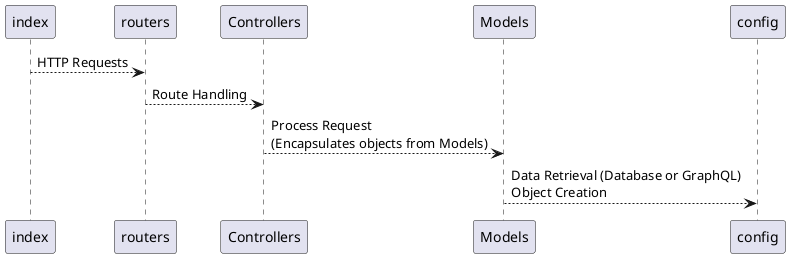

# Oxygen CS Groupe n°02 - Équipe n°03

## Description

Développement de la solution logicielle Oxygen CS pour la compagnie Oxygen Software

## Contributions

-Aissaoui, Thamer                      
-Caron, Louis-Antoine                             
-Nassih, Nabil

## Installation

1. Pull project
2. naviger au `/src`
3. `npm install`
4. mettre le fichier `.env` à la base du dossier `/src`
5. `npm run dev` ou `npm run start`
6. Pour tester `npm run test` **Pas implemente encore**

## File structure

```
config
    ├── db.mjs - A helper to query the database
    └── github.mjs - A helper to query the github repo
controllers
    ├── abstract.mjs - Helper for API responses
    ├── metriquesKanban.mjs - cree la reponse
    ├── metriquesPullRequests.mjs - cree la reponse
    ├── metriquesVisualisation.mjs - cree la reponse
    └── test.mjs - POUR TESTS
models
    ├── kanbanState.mjs - la ou on fait la query et on cree l'objet
    └── PR.mjs - la ou on fait la query et on cree l'objet
routers
    ├── metriquesKanban.mjs - Défini les routes 
    ├── metriquesPullRequests.mjs - Défini les routes 
    ├── metriquesVisualisation.mjs - Défini les routes 
    └── test.mjs - POUR TESTS
index.mjs - Main entry point module

```

## Path example 

